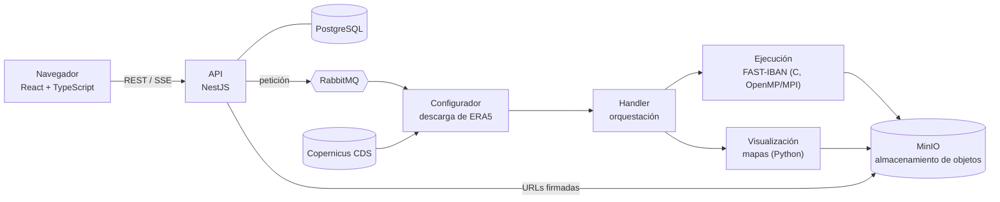

# AtmosBlock

[English](README.md) · **Español**

[](https://github.com/Victor-Hndz/AtmosBlock-WebPortal/actions/workflows/ci.yml)
[](LICENSE)

Detección determinista y clasificación morfológica de **bloqueos atmosféricos** a partir del
geopotencial en 500 hPa (Z500), con un portal web para analizar bajo demanda datos del reanálisis ERA5.

> [!NOTE]
> Software de investigación en desarrollo activo. El núcleo científico está probado y es
> reproducible; el portal web **todavía no está pensado para desplegarse en público**.

---

## Descripción

Un bloqueo atmosférico es una configuración de altas presiones casi estacionaria y persistente que
interrumpe el flujo del oeste en latitudes medias y se asocia a olas de calor, episodios fríos y
sequías persistentes. Existen muchos diagnósticos de bloqueo y discrepan en la frecuencia, la
posición y el tipo de los episodios que detectan ([Woollings et al., 2018](#referencias)).

AtmosBlock **no** propone un índice de bloqueo más. Aporta:

- **FAST-IBAN**, una implementación abierta y determinista en C de un detector de bloqueos basado
  en muestreo por círculos máximos, con una clasificación topológica del patrón del flujo (tipo
  Omega y tipo Rex). La clasificación cubre el aspecto morfológico del bloqueo, que la mayoría de
  índices no comprueba.
- **Un flujo de cálculo reproducible**: la misma entrada produce una salida idéntica bit a bit con
  cualquier número de hilos o procesos, comprobado en integración continua.
- **Un portal web** que descarga datos ERA5 del Climate Data Store de Copernicus, ejecuta el detector
  y devuelve mapas y resultados tabulares, sin que el usuario tenga que instalar nada.

El algoritmo **diagnostica** los campos que recibe. Si esos campos proceden de una previsión,
diagnostica la previsión; el algoritmo no hace predicciones.

## Método

Para cada paso temporal de un campo Z500 (ERA5, 0,25°):

1. **Puntos candidatos.** La rejilla se submuestrea cada 5 puntos (espaciado efectivo de 1,25°).
2. **Muestreo por rayos de círculo máximo.** Desde cada candidato se trazan 64 rayos (cada 5,625°)
   de 500 km sobre círculos máximos, y se interpola Z500 de forma bilineal en sus extremos. Un punto
   es candidato a alta (baja) si al menos el 90 % de los extremos están por debajo (por encima).
   - Como la distancia de muestreo es física y no un desplazamiento fijo en latitud, no degenera
     hacia el polo. `test_geometria_polar` comprueba que los 64 rayos siguen cayendo en celdas
     distintas a latitudes altas.
   - Los índices de gradiente como Tibaldi–Molteni o Davini et al. necesitan Z500 a desplazamientos
     meridionales fijos (p. ej., ±15°), así que no se pueden evaluar cerca del polo.
3. **Agrupamiento.** Los candidatos del mismo tipo forman clusters con conectividad 8. Cada cluster
   tiene un centroide (media vectorial en 3D) y un contorno representativo en múltiplos de 20 mgp.
4. **Clasificación morfológica.** Las altas se emparejan con las bajas vecinas mediante
   comprobaciones de contorno cerrado y de dirección, lo que da patrones **Omega** (una alta
   flanqueada por dos bajas) y **Rex** (dipolo alta–baja).

La salida se escribe en CSV:

| Fichero | Contenido |
|---|---|
| `*_selected_*.csv` | Puntos seleccionados: tiempo, latitud, longitud, Z500, tipo (MAX/MIN), cluster y su centroide |
| `*_formations_*.csv` | Patrones detectados: tiempo, ids de los clusters de alta y baja, tipo (OMEGA/REX) |
| `speed_*.csv`, `log_*.txt` | Tiempos por etapa y registro de la ejecución |

El alcance actual y las limitaciones están en la [hoja de ruta](#hoja-de-ruta). El algoritmo trabaja
sobre campos instantáneos; todavía no incluye la persistencia temporal (seguimiento).

## Rendimiento

Medido en un AMD Ryzen 5 5600X (6 núcleos / 12 hilos). Caso de prueba: ERA5 Z500 a 0,25°, 60 pasos
temporales (1–15 de agosto de 2003), 25–85°N. Todas las configuraciones producen la misma salida.

| Configuración | Tiempo de pared | Memoria pico por proceso |
|---|---:|---:|
| Serie | ≈ 17 s | < 30 MB |
| OpenMP, 12 hilos | ≈ 5,1 s | < 30 MB |
| MPI, 12 procesos | ≈ 2,6 s | < 30 MB |

La metodología, los tiempos por etapa, el escalado y una comparación del coste de cálculo con
TempestExtremes en las mismas condiciones están en [`docs/benchmark.md`](docs/benchmark.md).

## Arquitectura



| Componente | Tecnología |
|---|---|
| Núcleo científico | C11, NetCDF, OpenMP, MPI, CMake/CTest |
| Servicios de procesamiento | Python (asyncio, RabbitMQ, Cartopy) |
| API | NestJS (arquitectura hexagonal), TypeORM, PostgreSQL, JWT |
| Frontend | React, TypeScript, Redux Toolkit, Vite, i18n (inglés/español) |
| Infraestructura | Docker Compose, RabbitMQ, MinIO, GitHub Actions, CodeQL |

## Inicio rápido

**Solo el núcleo científico** (Docker, sin cuenta):

```bash
docker run --rm -v "$PWD:/src:ro" -w /src \
  victorhndz/netcdf-base@sha256:6f448a9eda3a12073be2c427d524d984387a85fc408a2f5755b648f59361a429 \
  sh -c 'cmake -S backend/FAST-IBAN_Project/execution/code -B /tmp/build \
         && cmake --build /tmp/build --parallel \
         && ctest --test-dir /tmp/build --output-on-failure'
```

**Pila completa** (requiere una cuenta gratuita de [Copernicus CDS](https://cds.climate.copernicus.eu)):

```bash
cp .env.example .env                    # y sustituye todos los valores "change-me"
docker compose up -d --build
cp frontend/.env.example frontend/.env
cd frontend && npm ci && npm run dev    # http://localhost:5173
```

La [guía de pruebas](docs/TESTING.es.md) detalla cada paso: ejecutar el detector sobre el caso de
ejemplo, comprobar el determinismo, lanzar los tests automáticos y recorrer el portal de principio a fin.

## Estructura del repositorio

```
backend/
  FAST-IBAN_Project/
    execution/code/     núcleo en C: fuentes, tests CTest, casos ERA5 de ejemplo, benchmark
    configurator/       servicio de descarga y preparación de ERA5
    handler/            servicio de orquestación
    visualization/      servicio de generación de mapas
    utils/              utilidades comunes de Python (RabbitMQ, MinIO, NetCDF)
  nestjs/               API REST
frontend/               cliente web
docs/                   benchmark y guía de pruebas
docker-compose.yml      pila completa
```

## Hoja de ruta

| Etapa | Objetivo | Estado |
|---|---|---|
| 0 | Red de seguridad: tests de regresión, comprobaciones de determinismo, CI | Hecho |
| 1 | Correcciones del núcleo y base de seguridad del portal | Hecho |
| 2 | Rendimiento (escalado OpenMP/MPI, memoria) y endurecimiento | Hecho |
| 3 | Generalización: ambos hemisferios, régimen polar, parámetros configurables, máscaras CF-NetCDF | Siguiente |
| 4 | Seguimiento temporal de episodios (TempestExtremes) y portal desplegable | Previsto |
| 5 | Validación frente a índices de bloqueo establecidos y despliegue público | Previsto |

El avance y otras notas se publican también en la [wiki del proyecto](https://github.com/Victor-Hndz/AtmosBlock-WebPortal/wiki).

## Origen académico

- **FAST-IBA³N** nació como Trabajo Fin de Grado (Ingeniería Informática, Universidad Miguel Hernández
  de Elche, 2024), dirigido por José Antonio García Orza y Héctor Francisco Migallón Gomis:
  Hernández Sánchez, V. *Diseño y aceleración de nuevos procedimientos de identificación automatizada
  de bloqueos atmosféricos en el Atlántico Norte*. [hdl:11000/32775](https://hdl.handle.net/11000/32775)
- **El portal web** se desarrolló como Trabajo Fin de Máster en la Universidad de Murcia.

Desde entonces el proyecto ha ido más allá de ambos trabajos.

## Cómo citar

Si usas este software, cítalo, por favor. GitHub ofrece los formatos APA y BibTeX en
**"Cite this repository"**, generados a partir de [`CITATION.cff`](CITATION.cff).

## Atribución de los datos

Los casos de ejemplo y los datos que descarga el portal contienen información modificada del
Copernicus Climate Change Service. Ni la Comisión Europea ni el ECMWF son responsables del uso que se
haga de la información de Copernicus ni de los datos que contiene.

- Hersbach, H., et al. (2023). *ERA5 hourly data on pressure levels from 1940 to present.*
  Copernicus Climate Change Service (C3S) Climate Data Store (CDS).
  [doi:10.24381/cds.bd0915c6](https://doi.org/10.24381/cds.bd0915c6)

## Referencias

- Davini, P., Cagnazzo, C., Gualdi, S., & Navarra, A. (2012). Bidimensional diagnostics,
  variability, and trends of Northern Hemisphere blocking. *Journal of Climate*, 25(19), 6496–6509.
  [doi:10.1175/JCLI-D-12-00032.1](https://doi.org/10.1175/JCLI-D-12-00032.1)
- Hersbach, H., et al. (2020). The ERA5 global reanalysis. *Quarterly Journal of the Royal
  Meteorological Society*, 146(730), 1999–2049. [doi:10.1002/qj.3803](https://doi.org/10.1002/qj.3803)
- Tibaldi, S., & Molteni, F. (1990). On the operational predictability of blocking. *Tellus A*,
  42(3), 343–365. [doi:10.3402/tellusa.v42i3.11882](https://doi.org/10.3402/tellusa.v42i3.11882)
- Ullrich, P. A., & Zarzycki, C. M. (2017). TempestExtremes: a framework for scale-insensitive
  pointwise feature tracking on unstructured grids. *Geoscientific Model Development*, 10(3), 1069–1090.
  [doi:10.5194/gmd-10-1069-2017](https://doi.org/10.5194/gmd-10-1069-2017)
- Woollings, T., et al. (2018). Blocking and its response to climate change. *Current Climate Change
  Reports*, 4(3), 287–300. [doi:10.1007/s40641-018-0108-z](https://doi.org/10.1007/s40641-018-0108-z)

## Licencia y contacto

Autor: Víctor Hernández Sánchez · ORCID [0009-0002-2391-1256](https://orcid.org/0009-0002-2391-1256)

Publicado con [licencia MIT](LICENSE). Problemas de seguridad: consulta [SECURITY.md](SECURITY.md).
Dudas y colaboraciones: [abre una issue](https://github.com/Victor-Hndz/AtmosBlock-WebPortal/issues)
o escribe a [vic.hernandezs08@gmail.com](mailto:vic.hernandezs08@gmail.com).
