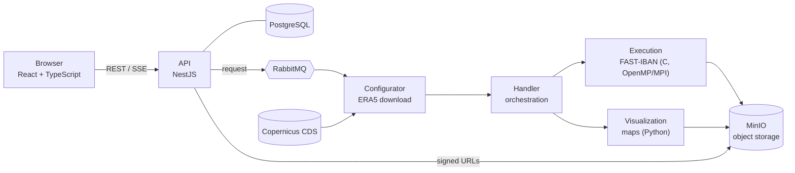

# AtmosBlock

**English** · [Español](README.es.md)

[](https://github.com/Victor-Hndz/AtmosBlock-WebPortal/actions/workflows/ci.yml)
[](LICENSE)

Deterministic detection and morphological classification of **atmospheric blocking** from
500 hPa geopotential (Z500), with a web portal for on-demand analysis of ERA5 reanalysis data.

> [!NOTE]
> Research software under active development. The scientific core is tested and reproducible;
> the web portal is **not yet intended for public deployment**.

---

## Overview

Atmospheric blocking is a quasi-stationary, long-lived high-pressure pattern that interrupts the
mid-latitude westerly flow and is associated with persistent heat waves, cold spells and droughts.
Many blocking diagnostics exist, and they disagree in frequency, location and type of the events
they detect ([Woollings et al., 2018](#references)).

AtmosBlock does **not** propose yet another blocking index. It provides:

- **FAST-IBAN**, an open, deterministic C implementation of a blocking detector based on
  great-circle sampling, together with a topological classification of the flow pattern
  (Omega-type and Rex-type). The classification addresses the morphological aspect of blocking,
  which most indices do not check.
- **A reproducible computational workflow**: the same input yields bit-identical output with any
  number of threads or processes, verified in continuous integration.
- **A web portal** that downloads ERA5 data from the Copernicus Climate Data Store, runs the
  detector and returns maps and tabular results, without requiring users to install anything.

The algorithm **diagnoses** the fields it is given. When those fields come from a forecast, it
diagnoses the forecast; it does not make predictions itself.

## Method

For each time step of a Z500 field (ERA5, 0.25°):

1. **Candidate points.** The grid is sub-sampled every 5 points (1.25° effective spacing).
2. **Great-circle ray sampling.** From each candidate, 64 rays (every 5.625°) of 500 km are traced
   along great circles, and Z500 is bilinearly interpolated at their end points. A point is a
   high (low) candidate when at least 90 % of the end points are lower (higher).
   - Because the sampling distance is physical rather than a fixed latitude offset, it does not
     degenerate toward the pole. `test_geometria_polar` checks that the 64 rays still land on
     distinct grid cells at high latitudes.
   - Gradient-based indices such as Tibaldi–Molteni or Davini et al. need Z500 at fixed
     meridional offsets (e.g. ±15°), so they cannot be evaluated close to the pole.
3. **Clustering.** Candidates of the same type form 8-connected clusters. Each cluster gets a
   centroid (3-D vector mean) and a representative contour at multiples of 20 gpm.
4. **Morphological classification.** Highs are paired with neighbouring lows through closed-contour
   and directional checks, yielding **Omega** (a high flanked by two lows) and **Rex**
   (high–low dipole) patterns.

Output is written as CSV:

| File | Contents |
|---|---|
| `*_selected_*.csv` | Selected points: time, latitude, longitude, Z500, type (MAX/MIN), cluster and its centroid |
| `*_formations_*.csv` | Detected patterns: time, high and low cluster ids, type (OMEGA/REX) |
| `speed_*.csv`, `log_*.txt` | Timings per stage and run log |

Current scope and limitations are listed in the [roadmap](#roadmap). The algorithm operates on
instantaneous fields; temporal persistence (tracking) is not yet included.

## Performance

Measured on an AMD Ryzen 5 5600X (6 cores / 12 threads). Test case: ERA5 Z500 at 0.25°, 60 time
steps (1–15 August 2003), 25–85°N. Every configuration produces identical output.

| Configuration | Wall time | Peak memory per process |
|---|---:|---:|
| Serial | ≈ 17 s | < 30 MB |
| OpenMP, 12 threads | ≈ 5.1 s | < 30 MB |
| MPI, 12 processes | ≈ 2.6 s | < 30 MB |

Methodology, stage-level timings, scaling and a cost comparison with TempestExtremes run under
the same conditions are in [`docs/benchmark.md`](docs/benchmark.md) (in Spanish).

## Architecture



| Component | Technology |
|---|---|
| Scientific core | C11, NetCDF, OpenMP, MPI, CMake/CTest |
| Processing services | Python (asyncio, RabbitMQ, Cartopy) |
| API | NestJS (hexagonal architecture), TypeORM, PostgreSQL, JWT |
| Frontend | React, TypeScript, Redux Toolkit, Vite, i18n (English/Spanish) |
| Infrastructure | Docker Compose, RabbitMQ, MinIO, GitHub Actions, CodeQL |

## Quick start

**Scientific core only** (Docker, no account needed):

```bash
docker run --rm -v "$PWD:/src:ro" -w /src \
  victorhndz/netcdf-base@sha256:6f448a9eda3a12073be2c427d524d984387a85fc408a2f5755b648f59361a429 \
  sh -c 'cmake -S backend/FAST-IBAN_Project/execution/code -B /tmp/build \
         && cmake --build /tmp/build --parallel \
         && ctest --test-dir /tmp/build --output-on-failure'
```

**Full stack** (requires a free [Copernicus CDS](https://cds.climate.copernicus.eu) account):

```bash
cp .env.example .env                    # then replace every "change-me" value
docker compose up -d --build
cp frontend/.env.example frontend/.env
cd frontend && npm ci && npm run dev    # http://localhost:5173
```

The [testing guide](docs/TESTING.md) covers every step in detail: running the detector on the sample
case, checking determinism, running the automated tests and walking through the portal end to end.

## Repository layout

```
backend/
  FAST-IBAN_Project/
    execution/code/     C core: sources, CTest suite, sample ERA5 cases, benchmark
    configurator/       ERA5 download and preparation service
    handler/            orchestration service
    visualization/      map generation service
    utils/              shared Python utilities (RabbitMQ, MinIO, NetCDF)
  nestjs/               REST API
frontend/               web client
docs/                   benchmark and testing guide
docker-compose.yml      full stack
```

## Roadmap

| Stage | Focus | Status |
|---|---|---|
| 0 | Safety net: regression tests, determinism checks, CI | Done |
| 1 | Correctness fixes in the core, portal security baseline | Done |
| 2 | Performance (OpenMP/MPI scaling, memory) and hardening | Done |
| 3 | Generalisation: both hemispheres, polar regime, configurable parameters, CF-NetCDF masks | Next |
| 4 | Temporal tracking of events (TempestExtremes) and a deployable portal | Planned |
| 5 | Validation against established blocking indices and public deployment | Planned |

Progress and notes are also published in the [project wiki](https://github.com/Victor-Hndz/AtmosBlock-WebPortal/wiki).

## Academic origin

- **FAST-IBA³N** (*Automatic identification of atmospheric blocking in the North Atlantic*) started
  as a bachelor's thesis at Universidad Miguel Hernández de Elche, supervised by José Antonio García
  Orza and Héctor Francisco Migallón Gomis.
- **The web portal** was developed as a master's thesis at Universidad de Murcia.

The project has since been extended beyond both theses.

## Citation

If you use this software, please cite it. GitHub provides APA and BibTeX formats under
**"Cite this repository"**, generated from [`CITATION.cff`](CITATION.cff).

## Data attribution

The sample cases and the data downloaded by the portal contain modified Copernicus Climate Change
Service information. Neither the European Commission nor ECMWF is responsible for any use that may
be made of the Copernicus information or data it contains.

- Hersbach, H., et al. (2023). *ERA5 hourly data on pressure levels from 1940 to present.*
  Copernicus Climate Change Service (C3S) Climate Data Store (CDS).
  [doi:10.24381/cds.bd0915c6](https://doi.org/10.24381/cds.bd0915c6)

## References

- Davini, P., Cagnazzo, C., Gualdi, S., & Navarra, A. (2012). Bidimensional diagnostics,
  variability, and trends of Northern Hemisphere blocking. *Journal of Climate*, 25(19), 6496–6509.
- Hersbach, H., et al. (2020). The ERA5 global reanalysis. *Quarterly Journal of the Royal
  Meteorological Society*, 146(730), 1999–2049.
- Tibaldi, S., & Molteni, F. (1990). On the operational predictability of blocking. *Tellus A*,
  42(3), 343–365.
- Ullrich, P. A., & Zarzycki, C. M. (2017). TempestExtremes: a framework for scale-insensitive
  pointwise feature tracking on unstructured grids. *Geoscientific Model Development*, 10(3), 1069–1090.
- Woollings, T., et al. (2018). Blocking and its response to climate change. *Current Climate Change
  Reports*, 4(3), 287–300.

## License and contact

Released under the [MIT License](LICENSE). Security issues: see [SECURITY.md](SECURITY.md).
Questions and collaboration: [open an issue](https://github.com/Victor-Hndz/AtmosBlock-WebPortal/issues)
or write to [vic.hernandezs08@gmail.com](mailto:vic.hernandezs08@gmail.com).
